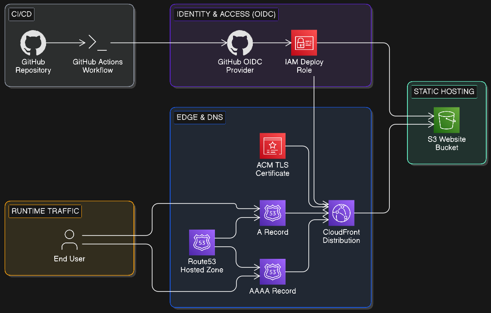
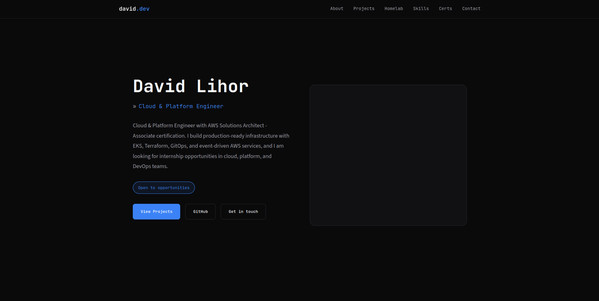

# Portfolio CI/CD Pipeline

This repo contains my portfolio website and the AWS infrastructure used to deploy it automatically.

## Overview

On every push to `main` (for content files), GitHub Actions:
- assumes an AWS role using OIDC,
- syncs website files to S3,
- invalidates CloudFront cache.

Result: updates go live at [davidlihor.com](https://davidlihor.com) in a few minutes, without manual AWS console steps.

## What Is In This Project

- `index.html` with the portfolio UI/content
- `images/` and `Resume.pdf` as static assets
- `.github/workflows/deploy.yml` for CI/CD deployment
- `terraform/environments/` for production environment config (providers, module usage, OIDC role/policy)
- `terraform/modules/static_website/` for reusable AWS website infra module

## Architecture

The infrastructure is provisioned with Terraform and includes:
- Route53 hosted zone + A/AAAA alias records
- ACM certificate in `us-east-1` for CloudFront
- CloudFront distribution (HTTPS redirect + CDN caching)
- private S3 bucket as origin
- CloudFront Origin Access Control (OAC) so only CloudFront can read from S3

## CI/CD Flow

Workflow file: `.github/workflows/deploy.yml`

- Trigger: push to `main` for website asset paths (`index.html`, `Resume.pdf`, `images/**`, image extensions)
- Auth: GitHub OIDC + `AWS_ROLE_ARN` (no long-lived AWS access keys)
- Deploy: `aws s3 sync` with excludes for `.git`, `.github`, `terraform`, `screenshots`, etc.
- Release: CloudFront invalidation for `/*`

## Tech Stack

- Terraform
- AWS S3, CloudFront, Route53, ACM, IAM
- GitHub Actions (OIDC)
- HTML, CSS, JavaScript

## Key Decisions

- **Terraform over ClickOps**: all AWS resources are versioned, reproducible, and reviewable in Git.
- **OIDC for GitHub Actions**: deployment uses short-lived role assumption instead of long-lived AWS keys.
- **Private S3 + CloudFront OAC**: bucket access is restricted to CloudFront, keeping origin content non-public.

## Portfolio Homepage

## Author

**David Lihor**

- Website: [davidlihor.com](https://davidlihor.com)
- GitHub: [github.com/davidlihor](https://github.com/davidlihor)
- LinkedIn: [linkedin.com/in/david-lihor](https://linkedin.com/in/david-lihor)